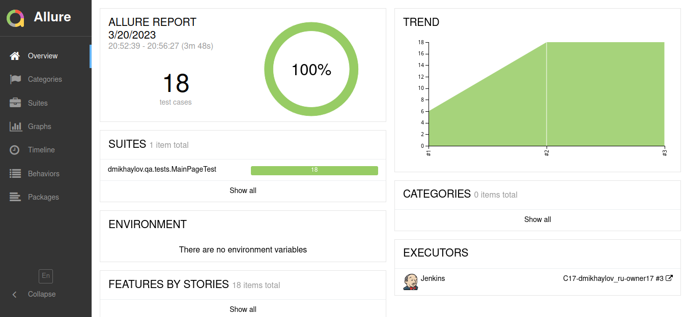
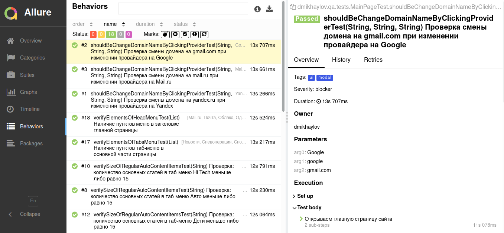
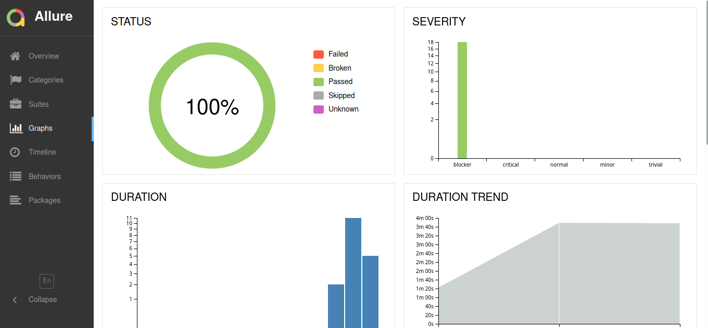

# Автоматизация тестирования <a href="https://mail.ru" target="_blank"> mail.ru</a>

## :scroll: Содержание
- [Технологии и инструменты](#pushpin-технологии-и-инструменты)
- [Запуск тестов](#pushpin-запуск-тестов)
- [Описание параметров для сборки](#pushpin-описание-параметров-для-сборки)
- [Отчёт Allure](#pushpin-отчёт-allure)
- [Allure TO](#pushpin-allure-to)
- [Задача в JIRA](#pushpin-задача-в-jira)
- [Отчёт Telegram](#pushpin-отчёт-telegram)

## :pushpin: Технологии и инструменты

## :pushpin: Запуск тестов
### Локально
<code>gradle clean test -Dbrowser=chrome -DbrowserVersion=100.0 -DbrowserSize=800x600</code>

### Удалённо
<code>clean test -Dbrowser=chrome -DbrowserVersion=100.0 -DbrowserSize=800x600 -Dremote=selenoid.autotests.cloud</code>

## :pushpin: Описание параметров для сборки
- <code>BROWSER</code> браузер, по умолчанию chrome
- <code>BROWSER_VERSION</code> версия браузера, по умолчанию 100.0
- <code>BROWSER_SIZE</code> размер окна браузера, по умолчанию 1920x1080
- <code>REMOTE</code> адрес удаленного сервера

## :pushpin: Отчёт Allure

## :pushpin: Allure TO
### Автоматические тест-кейсы

### Создание ручного тест-кейса

## :pushpin: Задача в JIRA

## :pushpin: Отчёт Telegram

[Вернуться к содержанию](#scroll-содержание)

