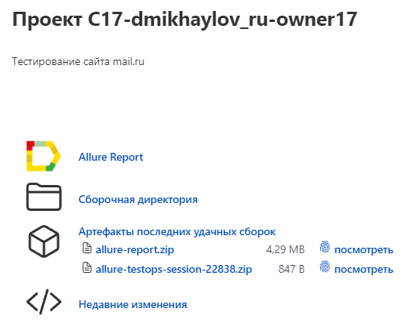
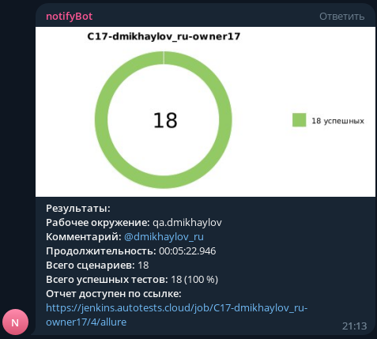

# Автоматизация тестирования <a href="https://mail.ru" target="_blank"> mail.ru</a>

## :scroll: Содержание
- [Технологии и инструменты](#pushpin-технологии-и-инструменты)
- [Запуск тестов](#pushpin-запуск-тестов)
- [Конфигурация тестов](#pushpin-конфигурация-тестов)
- [Описание параметров для сборки](#pushpin-описание-параметров-для-сборки)
- [Задача в Jenkins](#pushpin-задача-в-jenkins)
- [Отчёт Allure](#pushpin-отчёт-allure)
- [Отчёт Telegram](#pushpin-отчёт-telegram)

## :pushpin: Технологии и инструменты

## :pushpin: Запуск тестов
### Локально
<code>gradle clean test -Denv=local</code>

### Удалённо
<code>clean test -Denv=remote</code>

## :pushpin: Конфигурация тестов
### local.properties
- <code>baseUrl</code> - тестируемый ресурс
- <code>browserName</code> - название браузера (chrome, firefox)
- <code>browserVersion</code> - версия браузера
- <code>browserSize</code> - размер окна браузера

### remote.properties
- <code>baseUrl</code> - тестируемый ресурс
- <code>browserName</code> - название браузера (chrome, firefox)
- <code>browserVersion</code> - версия браузера
- <code>browserSize</code> - размер окна браузера
- <code>remote</code> - адрес сервера с selenoid

## :pushpin: Описание параметров для сборки
- <code>ENV</code> окружение, в котором запускаютя тесты, по умолчанию remote

## :pushpin: Задача в Jenkins

## :pushpin: Отчёт Allure

## :pushpin: Отчёт Telegram

[Вернуться к содержанию](#scroll-содержание)